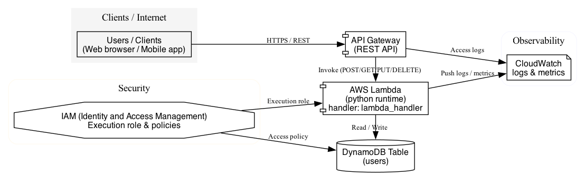

# Serverless API (Terraform + LocalStack)

## Overview

This project builds a complete serverless API locally, simulating AWS using Terraform and LocalStack. It covers API routing, Lambda functions, IAM roles, and persistent data.

## Architecture Components
- **API Tier**: API Gateway with REST endpoints
- **Compute Tier**: AWS Lambda functions (Python runtime)
- **Data Tier**: DynamoDB NoSQL database
- **Security Tier**: IAM roles and policies

## Key Features
- Complete CRUD API operations (Create, Read, Update, Delete)
- RESTful API design with proper HTTP methods
- DynamoDB integration with proper data modeling
- IAM roles with least privilege security
- Lambda environment variables configuration
- Modular Terraform structure
- Fully local deployment (no AWS account required)

## Requirements
- Terraform 1.0+
- LocalStack
- AWS CLI (or awslocal)
- Docker
- Python 3.9+

## Start LocalStack

<pre><code>docker run -d -p 4566:4566 \
  -e SERVICES=lambda,apigateway,dynamodb,iam \
  -e LAMBDA_EXECUTOR=docker \
  -v /var/run/docker.sock:/var/run/docker.sock \
  --name localstack \
  localstack/localstack</code></pre>

*Note: Update endpoints in `envs/dev/main.tf` if using different ports*

## Prepare Lambda Function

<pre><code># Create Lambda deployment package
zip lambda.zip lambda_function.py
cp lambda.zip envs/dev/</code></pre>

## Deploy Infrastructure

<pre><code>cd envs/dev
terraform init
terraform apply -auto-approve</code></pre>

## Show Terraform Outputs

<pre><code>cd envs/dev
terraform output</code></pre>

## API Endpoints

- `GET /users` - List all users
- `POST /users` - Create new user
- `GET /users/{id}` - Get user by ID  
- `PUT /users/{id}` - Update user
- `DELETE /users/{id}` - Delete user

## Auto-Verification Script

<pre><code>#!/usr/bin/env bash
echo "Verifying serverless deployment..."

echo "Terraform Outputs:"
(cd envs/dev && terraform output)

echo "API Gateway REST APIs:"
aws --endpoint-url=http://localhost:4566 apigateway get-rest-apis \
  --query 'items[].[id,name,description]' --output table

echo "Lambda Functions:"
aws --endpoint-url=http://localhost:4566 lambda list-functions \
  --query 'Functions[].[FunctionName,Runtime,Handler]' --output table

echo "DynamoDB Tables:"
aws --endpoint-url=http://localhost:4566 dynamodb list-tables \
  --query 'TableNames[]' --output table

echo "IAM Roles:"
aws --endpoint-url=http://localhost:4566 iam list-roles \
  --query 'Roles[?contains(RoleName, `dev-`)].RoleName' --output table

echo "Testing API Endpoints:"
API_URL=$(cd envs/dev && terraform output -raw api_url 2>/dev/null || echo "http://localhost:4566/restapis/$(aws --endpoint-url=http://localhost:4566 apigateway get-rest-apis --query 'items[0].id' --output text)/dev/_user_request_/users")
echo "API URL: $API_URL"

echo "Complete!"
</code></pre>

## Run Script

<pre><code>chmod +x verify-deployment.sh
./verify-deployment.sh</code></pre>

## Test API Endpoints

<pre><code># Get API URL from Terraform outputs
API_URL=$(cd envs/dev && terraform output -raw api_url)

# Test GET /users
curl -s "$API_URL"

# Test POST /users
curl -X POST "$API_URL" \
  -H "Content-Type: application/json" \
  -d '{"userId": "test123", "name": "Test User", "email": "test@example.com"}'

# Test GET /users/test123  
curl -s "${API_URL%/users}/users/test123"</code></pre>

## Folder Structure

<pre><code>project2-serverless-api/
├── modules/
│   ├── api_gateway/
│   │   ├── main.tf
│   │   ├── variables.tf
│   │   └── outputs.tf
│   ├── lambda/
│   │   ├── main.tf
│   │   ├── variables.tf
│   │   └── outputs.tf
│   └── dynamodb/
│       ├── main.tf
│       ├── variables.tf
│       └── outputs.tf
├── envs/
│   └── dev/
│       ├── main.tf
│       ├── variables.tf
│       ├── outputs.tf
│       └── terraform.tfvars
├── lambda_function.py</code></pre>

## Architecture Diagram

[]
